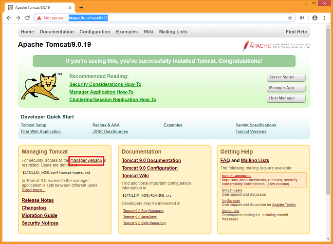
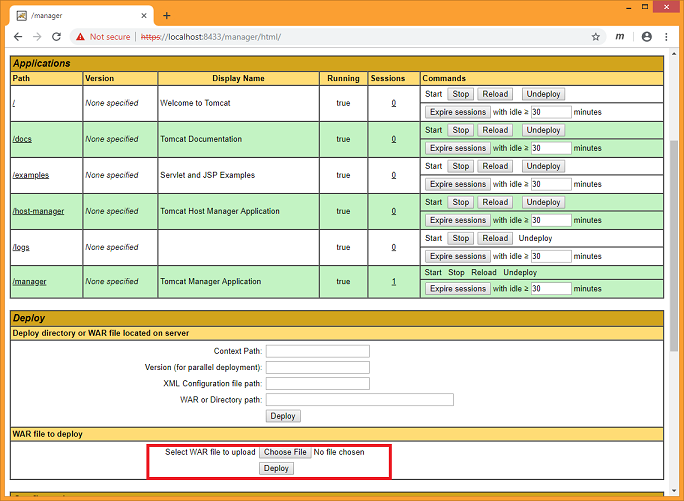
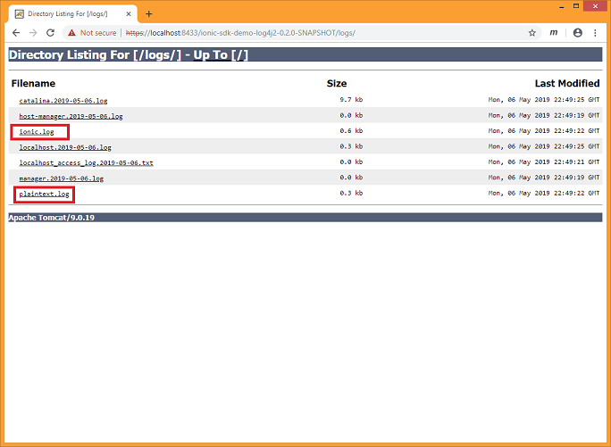

# Ionic Java SDK Sample Web Application / Log4j / Tomcat

The [Ionic SDK](https://dev.ionic.com/) provides an easy-to-use interface to the
[Ionic Platform](https://www.ionic.com/). In particular, the Ionic SDK exposes functions to perform Key Management
and Data Encryption.

With the release of version 2.5 of the Ionic Java SDK (May 2019), a new file encryption format has been added:
*GenericFileCipher version 1.3*.  The semantics of this new file format include support for variable-sized chunks of
data within an encrypted file.

An interesting use case for the Ionic platform in general, and this file format in particular, involves the capture of
telemetry data from some automated process.  This sample webapp is intended to demonstrate a simple example of data
protection on capture: application log files.

## Prerequisites

- physical machine (or virtual machine) with the following software installed
  - [Git](https://git-scm.com/) distributed version control system 
  - Java Runtime Environment 7+ (either
    [OpenJDK JRE](https://openjdk.java.net/install/index.html) or
    [Oracle JRE](https://www.oracle.com/technetwork/java/javase/downloads/index.html))
  - [Apache Maven](https://maven.apache.org/) (Java software project management tool)
- a valid PKCS12 or JKS [SSL keystore file](https://tomcat.apache.org/tomcat-9.0-doc/ssl-howto.html)
- a valid [Ionic Secure Enrollment Profile](https://dev.ionic.com/getting-started/create-ionic-profile) (a plaintext
json file containing access token data)

During the walkthrough of this demo, you will download the following:
- current version of Apache Tomcat (Java web container application)
- the git repository associated with this demo

## Log4J

The open source package [log4j](https://logging.apache.org/log4j/2.x/) is a popular software library used to record
log messages during the operation of software applications.  It is hosted by the
[Apache Software Foundation](https://www.apache.org/), and distributed under the
[Apache Software License](https://www.apache.org/licenses/LICENSE-2.0).  Its permissive license, long history, and
extensive functionality have made it a popular choice in software projects.

[Java Logging Framework (en.wikipedia.org)](https://en.wikipedia.org/wiki/Java_logging_framework)

In 2014, log4j2 was released as a successor to log4j, offering significant improvements over its predecessor.  One
notable improvement is the use of the "lambda" feature to avoid unnecessarily computing a log string.  (If the logging
subsystem is configured to discard DEBUG messages, the log message need not be assembled.)

One popular feature of the log4j library is the extensibility of its appender concept.  Appenders are ways in which
log messages can be recorded.  The log4j package includes appenders that write to the process console, to files, to
databases, and to network endpoints.  Additional custom appenders may be authored and incorporated into an application's
workflow.

This sample webapp will demonstrate an Ionic-enabled appender that will encrypt log messages as they are written to log
files.  As these are flushed synchronously in the context of the call to the logging library, we take advantage of the
Ionic support for variable length blocks of ciphertext within the GenericFileCipher v1.3 format.  The ability to
recover the associated plaintext will also be demonstrated.

## Tomcat

Java is a popular language used in back-end web processes to serve dynamic content.   Among open source Java web
containers, [Tomcat](https://tomcat.apache.org/) and [Jetty](https://www.eclipse.org/jetty/) are two of the most
popular.  Web containers allow packaged web applications (webapps) to be hosted, serving dynamic content upon request.
Web browsers like Google Chrome, Mozilla Firefox, and Apple Safari are popular web clients that interact with web
servers.

[Web container (en.wikipedia.org)](https://en.wikipedia.org/wiki/Web_container)

## Ionic Log4j2 Sample Application

This sample webapp is designed to run in a Tomcat web container.  As requests are
received by the webapp, log messages are sent to the log4j subsystem.  This webapp is configured with two appenders,
labelled "PLAINTEXT" and "IONIC".  The PLAINTEXT appender records messages normally to a stock
RollingFileAppender.  (This
appender handles rolling filesystem log files based on time periods, file size, or other conditions.)  The IONIC
appender is derived from RollingFileAppender, and records the same content, but encrypts it using GenericFileCipher
before writing to disk.  Both appenders are
configured to write to the "logs" folder of the running Tomcat instance.

The web app is also configured to serve content from the same "logs" folder.   It includes configuration specifying an
Ionic-enabled servlet filter that intercepts each incoming request.  When the requested resource URL includes the
string "ionic", the resulting resource is decrypted using another instance of GenericFileCipher, and the plaintext is
passed back to the web client.

## Ionic Log4j2 Sample Application, Repository Content

Let's take a brief tour of the content of this demo project.

### Maven Build Script

Maven is a commonly used build tool that will be used to assemble the demo project.

**[integration-log4j2/pom.xml]**

Here we declare the dependencies for the project.
```
    <dependencies>
        <dependency>
            <groupId>com.ionic</groupId>
            <artifactId>ionic-sdk</artifactId>
            <version>2.4.1-SNAPSHOT</version>
        </dependency>
        <dependency>
            <groupId>org.apache.tomcat</groupId>
            <artifactId>tomcat-servlet-api</artifactId>
            <version>9.0.19</version>
        </dependency>
        <dependency>
            <groupId>org.apache.logging.log4j</groupId>
            <artifactId>log4j-core</artifactId>
            <version>2.11.2</version>
        </dependency>
    </dependencies>
```
It is being built against current (May 2019) releases of Tomcat and Log4j.

### Log4j Appender Implementation

Two classes were derived from the log4j code: IonicRollingFileAppender and IonicAbstractOutputStreamAppender.  Ionic
additions to the classes are called out below.

**[integration-log4j2/src/main/java/com/ionic/sdk/addon/log4j2/core/appender/IonicRollingFileAppender.java]**

Here we are specifying an extra bit of Appender configuration.
``` java
    @PluginBuilderAttribute
    private String ionicProfile;
```
The variable *ionicProfile* holds the location (on the
classpath) of the resource containing the Ionic Secure Enrollment Profile (SEP) to be used.  The SEP contains
configuration specifying the Ionic server to use, as well as data to identify the client making the requests.  As the
default Tomcat configuration puts the content of the *lib* folder on the classpath, it is simple to put the SEP file
here.

The Ionic class *Agent* contains logic to interact with the Ionic server infrastructure.
``` java
    /**
     * Ionic state: interactivity with key services
     */
    private final Agent ionicAgent;
```

When an instance of *IonicRollingFileAppender* is constructed, the corresponding Ionic *Agent* class instance is
constructed.
``` java
    // initialize Ionic GenericFileCipher output
    this.ionicProfile = ionicProfile;
    Agent ionicAgentCtor = null;
    try {
        final URL urlIonicProfile = Resource.resolve(ionicProfile);
        final ProfilePersistor profilePersistor = new DeviceProfilePersistorPlainText(urlIonicProfile);
        ionicAgentCtor = new Agent(profilePersistor);
        StatusLogger.getLogger().info(ionicAgentCtor.getActiveProfile().getDeviceId());
    } catch (IonicException e) {
        StatusLogger.getLogger().error(e.getMessage());
    }
    this.ionicAgent = ionicAgentCtor;
```

When a new log4j output file is opened, a corresponding *GenericOutput* instance is constructed.  This adds the Ionic
header to the ciphertext, specifying the Ionic key in use for the file.
``` java
    // if log file rollover has occurred, reset Ionic GenericFileCipher output
    final long fileSize = getManager().getFileSize();
    if ((fileSize == 0) && (ionicAgent != null)) {
        try {
            super.setGenericOutput(ionicAgent);
        } catch (IOException e) {
            StatusLogger.getLogger().error(e.getMessage());
        } catch (IonicException e) {
            StatusLogger.getLogger().error(Integer.toString(e.getReturnCode()));
        }
    }
```


**[integration-log4j2/src/main/java/com/ionic/sdk/addon/log4j2/core/appender/IonicAbstractOutputStreamAppender.java]**

As each log4j message is sent to its output file, the content is encrypted and the encrypted content is substituted in
the output stream.
``` java
    private void writeByteArrayToManagerIonic(final byte[] bytes) {
        try {
            SdkData.checkTrue(genericOutput != null, SdkError.ISAGENT_NOINIT);
            final ByteBuffer bufferPlainText = genericOutput.getPlainText();
            bufferPlainText.clear();
            bufferPlainText.put(bytes);
            bufferPlainText.limit(bufferPlainText.position());
            bufferPlainText.position(0);
            genericOutput.write(bufferPlainText);
            final byte[] bytesIonic = bos.toByteArray();
            manager.writeBytes(bytesIonic, 0, bytesIonic.length);
            manager.flush();
            bos.reset();
        } catch (IOException e) {
            StatusLogger.getLogger().error("IOException", e);
        } catch (IonicException e) {
            StatusLogger.getLogger().error("IonicException", e);
        }
    }
```

### Tomcat Filter Implementation

A filter is an object that performs filtering tasks on either the request to a resource (a servlet or static content),
or on the response from a resource, or both.
[More Information](https://tomcat.apache.org/tomcat-9.0-doc/servletapi/javax/servlet/Filter.html)

The implementation of Filter in this demo is used to view the plaintext content of Ionic-protected files in the *logs*
folder.  A
simplistic algorithm is used to determine whether to apply Ionic decryption to the output resource, based on the name
of the requested resource.

**[integration-log4j2/src/main/java/com/ionic/sdk/addon/tomcat/servlet/IonicServletOutputStream.java]**

Contains boilerplate code needed for the implementation.

**[integration-log4j2/src/main/java/com/ionic/sdk/addon/tomcat/servlet/http/IonicServletResponseWrapper.java]**

Contains boilerplate code needed for the implementation.

**[integration-log4j2/src/main/java/com/ionic/sdk/addon/tomcat/servlet/IonicFilter.java]**

Analogous to the specification of *ionicProfile* in the log4j configuration, the Ionic Secure Enrollment Profile
resource location is specified in the filter config.  (These two SEPs may be different, if desired, but must refer to
the same keyspace.)  The instances of
the *Agent* class are independent of each other, and are only being used here to demonstrate Ionic capabilities.
``` java
    public void init() /*throws ServletException*/ {
        logger.traceEntry();
        final String ionicProfile = getFilterConfig().getInitParameter("ionic-profile");
        agent = null;
        if (ionicProfile != null) {
            try {
                final URL urlIonicProfile = Resource.resolve(ionicProfile);
                final ProfilePersistor profilePersistor = new DeviceProfilePersistorPlainText(urlIonicProfile);
                agent = new Agent(profilePersistor);
                logger.debug(agent.toString());
            } catch (IonicException e) {
                logger.error(e.getMessage(), e);
            }
        }
        logger.traceExit();
    }
```

The FilterChain is invoked here in order to assemble the web response, which includes the response bytes.
``` java
    // get the response entity
    final IonicServletResponseWrapper wrapper = new IonicServletResponseWrapper(servletResponse);
    filterChain.doFilter(servletRequest, wrapper);
    final byte[] responseEntity = wrapper.getBytes();
```

The decision is made here whether or not to apply Ionic decryption to the response.  The resource URL is used to make
this decision.  Another (slightly more expensive) algorithm would involve scanning the first few bytes of the response
entity header for the Ionic header text.
``` java
    // make decision whether to apply Ionic file cipher based on request file name
    final String servletPath = servletRequest.getServletPath();
    if ((servletPath.contains("ionic") && (agent != null))) {
        try {
            final Agent agentFilter = Agent.clone(agent);
            final GenericFileCipher fileCipher = new GenericFileCipher(agentFilter);
            final byte[] responseEntityPlain = fileCipher.decrypt(responseEntity);
            servletResponse.setHeader("Content-Type", "text/plain");
            servletResponse.setHeader("Content-Length", Integer.toString(responseEntityPlain.length));
            servletResponse.getOutputStream().write(responseEntityPlain);
        } catch (IonicException e) {
            servletResponse.setStatus(HttpServletResponse.SC_FORBIDDEN);
        }
    } else {
        servletResponse.setHeader("Content-Type", wrapper.getHeader("Content-Type"));
        servletResponse.setHeader("Content-Length", wrapper.getHeader("Content-Length"));
        servletResponse.getOutputStream().write(responseEntity);
    }
```

### Webapp Configuration

**[integration-log4j2/src/main/webapp/META-INF/context.xml]**

The default configuration of Tomcat does not specify that the content of the *logs* folder should be accessible.  This
configuration enables accessibility to the *logs* folder to demonstrate the Ionic functionality.
```
    <Resources>
        <PreResources base="${catalina.base}/logs" className="org.apache.catalina.webresources.DirResourceSet" webAppMount="/logs" />
    </Resources>
```

**[integration-log4j2/src/main/resources/log4j2.xml]**

This file specifies the log4j2 configuration for the webapp.

The *packages* attribute of this element is the log4j means to expose extensions to its functionality.
```
<Configuration noxmlns='http://logging.apache.org/log4j/2.0/config' packages="com.ionic.sdk.addon.log4j2" status="info">
```

Two appenders are defined here.  The first writes log messages normally to the configured output file.  The second applies
Ionic encryption to the content before it is written.  The appenders are otherwise identical.  This configuration is
used to demonstrate the Ionic capabilities.
```
    <Appenders>
        <RollingFile name="PLAINTEXT" fileName="${logdir}/plaintext.log" filePattern="${logdir}/plaintext.%d{yyyy-MM-dd}-%i.log">
            ... check log4j documentation for available options ...
        </RollingFile>
        <IonicRollingFile name="IONIC" fileName="${logdir}/ionic.log" filePattern="${logdir}/ionic.%d{yyyy-MM-dd}-%i.log"
                          ionicProfile="ionic.sep.plaintext.json">
            ... check log4j documentation for available options ...
        </IonicRollingFile>
    </Appenders>
```

The configuration for the PLAINTEXT and IONIC loggers is identical, in order to demonstrate the altered handling of
the Ionic-enabled appender.
```
    <Loggers>
        <Root level="INFO">
            <AppenderRef ref="PLAINTEXT"/>
            <AppenderRef ref="IONIC"/>
        </Root>
        ...
    </Loggers>
```

To disable the PLAINTEXT logging, remove the **AppenderRef ref="PLAINTEXT"** elements from the *Loggers* declaration.
```
    <Loggers>
        <Root level="INFO">
            <AppenderRef ref="IONIC"/>
        </Root>
        ...
    </Loggers>
```

### Tomcat Configuration

Some modifications to the Tomcat download image are needed to fully enable this webapp demonstration.

**[tomcat/bin/catalina.bat]**

Edit this file, and add this line to turn off the default *log4j* handling of output messages, substituting the legacy 
output handling.
```
set "JAVA_OPTS=%JAVA_OPTS% -Dlog4j2.enable.direct.encoders=false"
```

**[tomcat/conf/server.pkcs12]**

Add this prerequisite file to the folder *[tomcat/conf]*.

**[tomcat/conf/ionic.sep.plaintext.json]**

The file contains the Ionic Secure Enrollment Profile (SEP) data, which defines the Ionic server to use, as well as 
data to identify the client making the requests.  Add this prerequisite file to the folder *[tomcat/conf]*.  More 
details can be found [here](https://dev.ionic.com/platform/enrollment).

**[tomcat/conf/server.xml]**

Edit this file to enable Tomcat to service TLS requests on an additional port.  The value of the setting 
*certificateKeystoreFile* will be the filesystem path of the valid PKCS12 or JKS keystore file, relative to the Tomcat 
root folder.  If your keystore is password-protected, the password will also be specified here.  More details can be 
found [here](https://tomcat.apache.org/tomcat-9.0-doc/ssl-howto.html).
```
    <!--
    <Connector port="8443" protocol="org.apache.coyote.http11.Http11NioProtocol"
               maxThreads="150" SSLEnabled="true">
        <SSLHostConfig>
            <Certificate certificateKeystoreFile="conf/localhost-rsa.jks"
                         type="RSA" />
        </SSLHostConfig>
    </Connector>
    -->
```

**[tomcat/conf/tomcat-users.xml]**

This allows access to the Tomcat manager UI, which allows easy deployment of this demo webapp.  Edit this file, and add 
configuration for a user with the *manager-gui* role.
```
    <user username="youruser" password="yourpassword" roles="manager-gui"/>
```

**[tomcat/lib/log4j-api-2.11.2.jar]**

**[tomcat/lib/log4j-appserver-2.11.2.jar]**

**[tomcat/lib/log4j-core-2.11.2.jar]**

These three libraries are not included in the default Tomcat download image, but provide the necessary classes and
configuration to use log4j within Tomcat.  Download them from the [Maven Central repository](https://repo1.maven.org/), 
and add them to the folder *[tomcat/lib]*.

- [log4j-api-2.11.2.jar](https://repo1.maven.org/maven2/org/apache/logging/log4j/log4j-api/2.11.2/log4j-api-2.11.2.jar).
- [log4j-appserver-2.11.2.jar](https://repo1.maven.org/maven2/org/apache/logging/log4j/log4j-appserver/2.11.2/log4j-appserver-2.11.2.jar).
- [log4j-core-2.11.2.jar](https://repo1.maven.org/maven2/org/apache/logging/log4j/log4j-core/2.11.2/log4j-core-2.11.2.jar).


## Demo Walkthrough

1. Download [Tomcat image](https://tomcat.apache.org/download-90.cgi).

1. Inflate image into an empty folder on your filesystem.

1. Modify image as detailed in section *Tomcat Configuration* above.

1. Clone git demo repository into an empty folder on your filesystem.
    ```
    git clone https://github.com/IonicDev/integration-log4j2.git
    ```
1. Navigate to the root folder of the *integration-log4j2* repository.  Run the following command to assemble the
demo webapp:
    ```
    mvn clean package
    ```

1. Navigate to the root folder of the Tomcat instance.  Run the following command to start Tomcat (Ctrl+C to stop):
    ```
    bin\catalina.bat run
    ```

1. Open a web browser, and navigate to the following URL:
    ```
    https://localhost:8443/
    ```
    The Tomcat home page will be displayed.

1. Click on the *manager webapp* link to navigate to the manager UI.

    

1. Scroll down on the manager UI page to the *WAR file to deploy* section.  Click the *Select File* button.  Select
the webapp just built by the Maven tool (located in *integration-log4j2/target*.  Click the *Deploy* button.

    

1. In the *Applications* section of the manager UI, the demo application will be added to the list of installed
webapps.  Click on the link to the application (in the left-most column of the *Applications* table entry).

1. Click the *logs* link.

    

1. Click the links for *ionic.log* and *plaintext.log*.  You should see the same content for each.  The file 
*plaintext.log* is retrieved from the filesystem and rendered by Tomcat unaltered.  The file *ionic.log* is retrieved 
from the filesystem and passed through a Tomcat filter, which decrypts the content and passes along the plaintext to 
the requester.

1. Navigate in the filesystem browser for your OS to the *logs* subfolder of the Tomcat root folder.  Open
*plaintext.log* and *ionic.log*.  Observe that your OS displays *plaintext.log* normally, but *ionic.log* as a file
with an Ionic file header, followed by ciphertext.  Without the Tomcat filter intermediary, the file content 
differences are apparent.

## Conclusion

This demo webapp has demonstrated a custom *log4j* appender that protects application log messages.  But Ionic software
and infrastructure may also be used to protect other forms of data.  Audio streams, video streams, network traffic, and
health-related telemetry might be captured and protected in a similar way.  Ionic's cryptography primitives and server
infrastructure are well-suited to protect data on capture as well as at rest.
